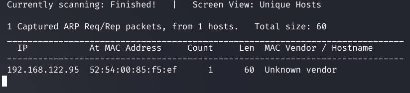

# Звіт про тестування на проникнення віртуальної машини ColddBox: Easy

**Ціль:** ColddBox: Easy (VulnHub, автор — C0ldd)
**Рівень складності:** легкий
**Атакувальна платформа:** Kali Linux
**Середовище розгортання:** QEMU/KVM, ізольована NAT-мережа `192.168.122.0/24`
**IP цілі:** `192.168.122.95`

---

## 1. Розвідка мережі

Перше завдання — знайти цільову машину в підмережі. Використано ARP-сканування:

```sh
sudo netdiscover -i virbr0 -r 192.168.122.0/24
```

`netdiscover` розсилає ARP-запити по всьому діапазону і слухає відповіді, тому знаходить навіть хости, що не відповідають на ICMP. Виявлено єдиний активний вузол.



## 2. Сканування портів

Далі — повне сканування TCP-портів з визначенням версій сервісів:

```sh
nmap -sV -p- 192.168.122.95
```

- `-p-` — усі 65535 портів;
- `-sV` — визначення версій служб.


**Результат сканування:**

| Порт | Служба | Версія |
|------|--------|--------|
| 80/tcp | HTTP | Apache httpd 2.4.18 (Ubuntu) |
| 4512/tcp | SSH | OpenSSH 7.2p2 Ubuntu |

В даному випалку SSH був перенесений на нестандартний порт 4512. Саме тут `-p-` знадобилось.

---

## 3. Перелік веб-застосунку

### 3.1 Огляд сайту

На 80-му порту працює WordPress. Головна сторінка представляє машину і називає її автора **C0ldd**.


### 3.2 Сканування користувачі за допомогою WPScan

```sh
wpscan --url http://deathnote.vuln/wordpress --enumerate vp,vt,u \                                                         
  --plugins-detection aggressive -o wpscan_enum --format cli-no-color
```

Виявлено три облікові записи: **philip**, **c0ldd**, **hugo**.


### 3.3 Пошук прихованих каталогів

```sh
gobuster dir -u http://192.168.122.95/ \
  -w /usr/share/wordlists/dirbuster/directory-list-2.3-medium.txt
```

Крім стандартних каталогів WordPress знайдено нетиповий `/hidden/`.


### 3.4 Аналіз каталогу /hidden/

Сторінка містить службову записку від `Philip` про те, що `C0ldd` змінив пароль користувачу `Hugo`. 


### 3.5 Підбір пароля

За знайденим користувачем `c0ldd` виконано словниковий підбір пароля через форму входу WordPress:

```sh
wpscan --url http://192.168.122.95 -U c0ldd -P /usr/share/wordlists/rockyou.txt
```

Пароль підібрано: **`c0ldd : 9876543210`**.


---

## 4. Отримання доступу

### 4.1 Вхід у панель адміністратора

Логінимось під адміном (c0ldd) і через вбудований редактор тем додамо реверсшел.


### 4.2 Впровадження PHP reverse shell

У футер додаємо реверсшел: **pentestmonkey/php-reverse-shell**, у якому вказуємо IP атакувальної машини та порт `4444`.

### 4.3 Перехоплення з'єднання

На Kali слухаємо вказаний порт:

```sh
nc -lvnp 4444
```

- `-l` — режим прослуховування, `-v` — детальний вивід, `-n` — без DNS-резолву, `-p 4444` — порт.

Відкриваємо сторінку з футером, шел встановлює з'єднання. (сторінка "зависає", оскільки замість продовження її загрузки сервер встановлює з'єднання з нашою машиною)


Відкриваємо сторінку з футером і отримуємо зворотне з'єднання від імені **www-data**. Робимо Shell Upgrade:


```sh
python3 -c 'import pty; pty.spawn("/bin/bash")'
```


---

## 5. Підвищення привілеїв

### 5.1 Витік облікових даних із wp-config.php

У корені веб-застосунку `/var/www/html/` прочитано конфігурацію WordPress:

```sh
cat wp-config.php
```

У файлі відкритим текстом зберігаються дані підключення до БД:

- `DB_USER = c0ldd`
- `DB_PASSWORD = cybersecurity`


### 5.2 Латеральний рух до користувача c0ldd

Знайдений пароль повторно використано для входу під локальним користувачем `c0ldd`. Для стабільного інтерактивного можна застосовувати знайдений SSH на нестандартному порті, але в даному випадку ми продовжимо роботу з реверсшелом:

```sh
ssh -p4512 c0ldd@192.168.122.95   # пароль: cybersecurity
```


У домашньому каталозі — перший прапорець, закодований у Base64:


### 5.3 Аналіз прав sudo

```sh
sudo -l
```

Користувач `c0ldd` має право запускати від `root` три бінарники:

```
(root) /usr/bin/vim
(root) /bin/chmod
(root) /usr/bin/ftp
```


Кожен із них дозволяє отримати права root. Нижче продемонстровано всі три незалежні вектори (довідник — GTFOBins).

### 5.4 Вектор 1 — chmod

Оскільки `chmod` виконується від `root`, каталог `/root` можна зробити доступним для читання і забрати другий прапорець:


### 5.5 Вектор 2 — vim

`vim`, запущений від `root`, дозволяє вийти в командну оболонку прямо з редактора:

Отримано shell з `uid=0(root)`.


### 5.6 Вектор 3 — ftp

`ftp` теж уміє запускати зовнішні команди через `!`:


Обидва вектори (vim, ftp) незалежно дають повноцінну оболонку `root`. chmod — було використане для читання файлів `root`. Машину повністю скомпрометовано.

---

## 6. Оцінка впливу

Отриманий доступ рівня `root` означає повний контроль над системою: читання й зміна будь-яких файлів, керування службами, створення користувачів, установлення бекдорів і закріплення. Обидва прапорці (`user.txt`, `root.txt`) здобуто — машину пройдено від неавтентифікованого зовнішнього доступу до суперкористувача.

## 7. Виявлені недоліки та рекомендації

| # | Недолік | Рекомендація |
|---|---------|--------------|
| 1 | Слабкий числовий пароль адміністратора WordPress (`9876543210`) | Стійкі паролі, обмеження спроб входу, вимкнення `xmlrpc.php` |
| 2 | Пароль БД у `wp-config.php` збігається з паролем ОС-користувача | Розділення облікових даних, унікальні паролі для кожного сервісу |
| 3 | Увімкнений редактор тем/плагінів у `wp-admin` (шлях до RCE) | `define('DISALLOW_FILE_EDIT', true);` у `wp-config.php` |
| 4 | Небезпечні записи в `sudoers` (`vim`, `chmod`, `ftp` від root) | Прибрати ці бінарники із sudo, дотримуватись принципу найменших привілеїв |
| 5 | Застаріле ПЗ (WordPress 4.1.31, Apache 2.4.18, Ubuntu 16.04, застарілі плагіни) | Регулярне оновлення системи та компонентів |
| 6 | Службова підказка в публічному каталозі `/hidden/` | Не зберігати чутливу інформацію в загальнодоступних місцях |

## 8. Висновки

Тестування показало, що ColddBox: Easy компрометується за рахунок ланцюжка типових, але критичних помилок конфігурації, а не одиничної складної вразливості. Слабкий пароль адміністратора відкрив доступ до `wp-admin`, увімкнений редактор тем перетворив цей доступ на віддалене виконання коду, а повторне використання пароля і надмірні права `sudo` дозволили піднятися до `root` одразу трьома способами. Висновок: важливу роль відіграє не лише актуальність ПЗ, а й загальна безепекова гігієна: розмежуванні доступу, стійкі паролі, мінімізації привілеїв тощо.